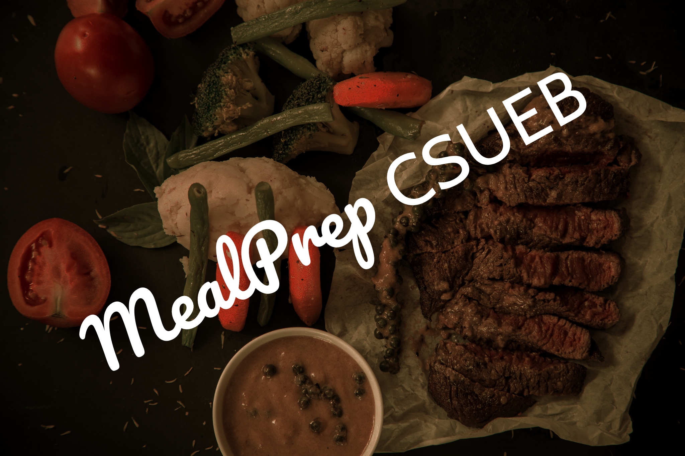

# My very first HTML/CSS project! 

This isn't my first time exploring HTML/CSS, but it is the first time that I actually put everything I've learned together into one single
project. ~It's a static website designed to be viewed preferably on a desktop. Moving forward I will be working on more responsive designs.~ Update: I decided to take a quick minute to make it a responsive design. It should now work fine in any modern smartphones or tablets.

This isn't for an actual business, I just so happened to be indulging in one of our (me and my S.O.'s) meal preps while trying to 
think of an idea for a website.

